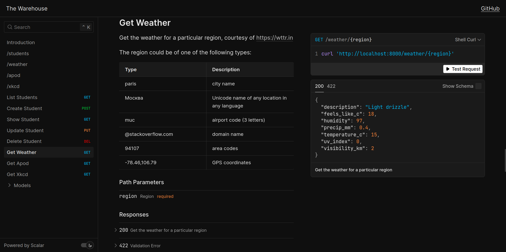

# keploy-assignment-api

## The Warehouse
**Version:** 0.0.1

[](https://github.com/BillyDoesDev/keploy-assignment-api/actions/workflows/test.yaml)


The Warehouse API helps you do... well, a bunch of random stuff!
For starters, feel free to check out the endpoints we provide:

### /students
Allows you to perform basic CRUD operations on a database - you may **search/create/update/delete** student records.

This section connects the app to a [MonboDb](https://www.mongodb.com/) Database, using docker. Persistence in data is ensured through named volumes. Additionally, [DbDate](https://dbgate.org/) is used to monitor and interact with the database.
<hr>

### /weather
Get the weather for a particular region, courtesy of https://wttr.in
<hr>

### /apod
Gets the Astronomy Picture of the Day, courtesy of [NASA](https://api.nasa.gov/).
<hr>

### /xkcd
Get an XKCD comic.
<hr>


## Getting Started

Make sure you have [Docker](https://www.docker.com/) installed on your system, since that's what we use to set up our databases.

Clone the reposiroy, `cd` into it and simply start up the containers!
```sh
git clone https://github.com/BillyDoesDev/keploy-assignment-api.git
cd keploy-assignment-api
docker compose up --build -d
```

You may then view your server logs using:
```sh
docker logs -f fastapi
```

And that's it! 🚀 

**You can access the API documentation over at http://localhost:8000/scalar.</br>**



> Beautiful and robust API docs, powered by [Scalar](https://www.scalar.com)

*Optionally, you could also check the docs using the default swagger UI on http://localhost:8000/docs.*

In either of the endpoints, you will find elaborate API documentation, along with a playground to test them out. Regardless, this repository contains the basic overview to help you get started.


## Endpoints

### `GET /students/`
**Summary:** List Students

List all of the student data in the database. 
The response is unpaginated and limited to `1000` results.

**Responses:**
- `200`: List all students

**Sample cURL:**
```bash
curl http://localhost:8000/students/
```

**Example 200 response**
```json
{
  "students": [
    {
      "course": "Experiments, Science, and Fashion in Nanophotonics",
      "email": "jdoe@example.com",
      "gpa": 3,
      "name": "Jane Doe"
    }
  ]
}
```

---

### `POST /students/`
**Summary:** Create Student

Insert a new student record.

A unique `id` will be created and provided in the response.

**Request Body:**
- Content-Type: `application/json`

**Responses:**
- `201`: Add new student
- `422`: Validation Error

**Sample cURL:**
```bash
curl http://localhost:8000/students/ \
  --request POST \
  --header 'Content-Type: application/json' \
  --data '{
  "course": "Experiments, Science, and Fashion in Nanophotonics",
  "email": "jdoe@example.com",
  "gpa": 4,
  "name": "Jane Doe"
}'
```

**Example 201 response**
```json
{
  "course": "Experiments, Science, and Fashion in Nanophotonics",
  "email": "jdoe@example.com",
  "gpa": 3,
  "name": "Jane Doe"
}
```
---

### `GET /students/{id}`
**Summary:** Show Student

Get the record for a specific student, looked up by `id`.

**Query/Path Parameters:**
- `id` (path) (required): 

**Responses:**
- `200`: Get a single student
- `422`: Validation Error

**Sample cURL:**
```bash
curl http://localhost:8000/students/6856146fb9a87b2a5f2b12c4
```

**Example 200 response**
```json
{
  "course": "Experiments, Science, and Fashion in Nanophotonics",
  "email": "jdoe@example.com",
  "gpa": 3,
  "name": "Jane Doe"
}
```

---

### `PUT /students/{id}`
**Summary:** Update Student

Update individual fields of an existing student record.

Only the provided fields will be updated.
Any missing or `null` fields will be ignored.

**Query/Path Parameters:**
- `id` (path) (required): 

**Request Body:**
- Content-Type: `application/json`

**Responses:**
- `200`: Update a student
- `422`: Validation Error

**Sample cURL:**
```bash
curl http://localhost:8000/students/6856146fb9a87b2a5f2b12c4 \
  --request PUT \
  --header 'Content-Type: application/json' \
  --data '{
  "course": "Experiments, Science, and Fashion in Nanophotonics",
  "email": "jdoe@horse.com",
  "gpa": 3,
  "name": "Jane Doe"
}'
```

**Example 200 response**
```json
{
  "course": "Experiments, Science, and Fashion in Nanophotonics",
  "email": "jdoe@example.com",
  "gpa": 3,
  "name": "Jane Doe"
}
```

---

### `DELETE /students/{id}`
**Summary:** Delete Student

Remove a single student record from the database.

**Query/Path Parameters:**
- `id` (path) (required): 

**Responses:**
- `200`: Delete a student
- `422`: Validation Error

**Sample cURL:**
```bash
curl http://localhost:8000/students/6856146fb9a87b2a5f2b12c4 \
  --request DELETE
```

**Example 200 response**
```json
null
```

---

### `GET /weather/{region}`
**Summary:** Get Weather

Get the weather for a particular region, courtesy of https://wttr.in

The region could be of one of the following types:

|Type                   |Description
|-----------------------|----------------
|paris                  |city name
|Москва                 |Unicode name of any location in any language
|muc                    |airport code (3 letters)
|@stackoverflow.com     |domain name
|94107                  |area codes
|-78.46,106.79          |GPS coordinates

**Query/Path Parameters:**
- `region` (path) (required): 

**Responses:**
- `200`: Get the weather for a particular region
- `422`: Validation Error

**Sample cURL:**
```bash
curl http://localhost:8000/weather/london
```

**Example 200 response**
```json
{
  "description": "Light drizzle",
  "feels_like_c": 18,
  "humidity": 97,
  "precip_mm": 0.4,
  "temperature_c": 15,
  "uv_index": 0,
  "visibility_km": 2
}
```

---

### `GET /apod`
**Summary:** Get Apod

Gets the Astronomy Picture of the Day, courtesy of [NASA](https://api.nasa.gov/). 

- `date`: The date of the APOD image to retrieve `(YYYY-MM-DD)`.
- `start_date`: The start date of a range `(YYYY-MM-DD)`.
- `end_date`: The end date of a range `(YYYY-MM-DD)`.
- `count`: If specified, returns a number of random APODs. **Cannot be used with `date` or a date range**.
- `thumbs`: If True, returns the thumbnail for video-type APODs.
- `api_key`: Your NASA API key. Defaults to `'DEMO_KEY'`.

**Query/Path Parameters:**
- `date` (query) : 
- `start_date` (query) : 
- `end_date` (query) : 
- `count` (query) : 
- `thumbs` (query) : 
- `api_key` (query) : 

**Responses:**
- `200`: Get Astronomy Picture of the Day
- `422`: Validation Error

**Sample cURL:**
```bash
curl 'http://localhost:8000/apod?api_key=DEMO_KEY'
```

**Example 200 response**
```json
[
  {
    "copyright": "Ramesh",
    "date": "2024-06-21",
    "explanation": "Astronomy Picture of the Day explanation text...",
    "hdurl": "https://apod.nasa.gov/apod/image/2406/example_hd.jpg",
    "media_type": "image",
    "service_version": "v1",
    "thumbnail_url": "https://apod.nasa.gov/apod/image/2406/thumb.jpg",
    "title": "A Stunning Galaxy",
    "url": "https://apod.nasa.gov/apod/image/2406/example.jpg"
  }
]
```

---

### `GET /xkcd`
**Summary:** Get Xkcd

Get an XKCD comic.

- `id`: The comic ID to fetch. If omitted, returns the latest comic.

**Query/Path Parameters:**
- `id` (query) : 

**Responses:**
- `200`: Get XKCD comic info by ID or latest
- `422`: Validation Error

**Sample cURL:**
```bash
curl http://localhost:8000/xkcd
```

**Example 200 response**
```json
{
  "alt": "If you don't have an extension cord I can get that too.  Because we're friends!  Right?",
  "day": "24",
  "img": "https://imgs.xkcd.com/comics/woodpecker.png",
  "link": "",
  "month": "7",
  "news": "",
  "num": 614,
  "safe_title": "Woodpecker",
  "title": "Woodpecker",
  "transcript": "[[Transcript text here...]]",
  "year": "2009"
}
```


--- 

## Testing

All tests have been written under the `tests/` directory. It covers all basic test cases, such as:
- [x] Unit tests (mocking, logic)
- [x] Integration (database logic)
- [x] API coverage (endpoints, response validation)


Tests are automatically run on every push, and on every pull request. 
In order to test it out yourself, you could do so via the docker container you've spun up:
```sh
docker exec fastapi sh -c "pip install -r requirements-dev.txt && sh run-tests.sh
```